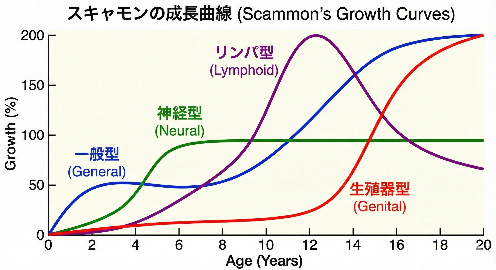

    <h1 class="doc-title theme-indigo">２．（２） LTADモデル（長期競技者育成）</h1>

    

        
<strong>「子供は小さな大人ではない」</strong>

        JBAも採用する世界標準の育成ロードマップです。目先の勝利という「点」ではなく、22歳での自立した姿をゴールとした「線」の指導を定義します。
    

    <h2 class="doc-section-title theme-green">１． 育成ピラミッド：成長の７段階</h2>
    
    
<strong>（１） 段階的アプローチの重要性</strong>

    

        
（Ａ） 下から積み上げる７つのステップ

        

            ・ １．アクティブスタート (Active Start) 
            ・ ２．楽しむ・動く (FUNdamentals) 
            ・ <strong>３．基礎を学ぶ (Learn to Train) 【★Ｕ１２世代】</strong> 
            ・ ４．トレーニング方法を学ぶ (Train to Train) 
            ・ ５．競技のためのトレーニング (Train to Compete) 
            ・ ６．勝つためのトレーニング (Train to Win) 
            ・ ７．生涯スポーツ (Active for Life)
        

    

    
<strong>（２） Ｕ１２世代の役割：ゴールデンエイジ</strong>

    

        
（Ａ） 即座習得期の活用

        

            ・ 脳と神経が一生のうちで最も発達する時期であり、見た動きをそのまま習得できる貴重な期間です。 
            ・ 特定の形に嵌めすぎず、多様な動きを経験させることが「運動神経の良い子」を育てる唯一の道です。
        

    

    

    <h2 class="doc-section-title theme-blue" style="--c-accent-dark: #1565c0;">２． 科学的根拠：スキャモンの発育曲線</h2>
    
    

        <strong>⚠️ 重要な注意：「４タイプの子供」がいるわけではありません</strong> 
        この図は、一人の子供の体の中で「脳や神経の部位」と「筋肉や骨の部位」が、それぞれ全く違うスピードで成長していることを示しています。
    

    
<strong>（１） 身体部位（システム）別の発達スピード</strong>

    

        
（Ａ） なぜＵ１２で「動き」が重要なのか

        

            <table class="doc-table doc-table--accent theme-blue" style="margin-top: 10px; font-size: 0.95em;">
                <tr>
                    <th class="doc-nowrap">成長部位</th>
                    <th class="doc-nowrap">Ｕ１２の状態</th>
                    <th>具体的な指導アクション</th>
                </tr>
                <tr>
                    <td class="doc-nowrap" style="color: #0d47a1;">神経系 （脳・回路）</td>
                    <td class="doc-nowrap">ほぼ100%完成</td>
                    <td>
                        <strong>今やるべきこと（ゴールデンエイジ）</strong> 
                        多種多様なステップ、リズム、ハンドリング。見た動きを真似させる。「器用さ」の回路を完結させる。
                    </td>
                </tr>
                <tr>
                    <td class="doc-nowrap" style="color: #e65100;">一般系 （骨・筋肉）</td>
                    <td class="doc-nowrap">未発達 （準備期間）</td>
                    <td>
                        <strong>重い負荷はＮＧ。自重とフォームを重視</strong> 
                        × ウェイトトレーニング、過度な走り込み。 
                        ○ 正しい姿勢でのスクワット、体幹、安全な着地動作。 
                        ○ 栄養と睡眠（１階部分）の徹底。
                    </td>
                </tr>
                <tr>
                    <td class="doc-nowrap" style="font-weight: normal; color: #666;">生殖器系 （ホルモン）</td>
                    <td class="doc-nowrap">これから発達</td>
                    <td>
                        パワー（筋肥大）は中学・高校以降まで待つ。「当たり負け」は気にしないよう指導する。
                    </td>
                </tr>
            </table>
        

    

    

        
        

            <strong>図：スキャモンの発育曲線</strong> 
            一番上の「神経型」は12歳で完成するが、「一般型（体格）」の成長はこれからであることが分かる。
        

    

    
    

    <h2 class="doc-section-title theme-red" style="--c-accent-dark: #c62828;">３． 早期専門化のリスク</h2>
    
    
<strong>（１） 特定ポジション・戦術への固定が招く弊害</strong>

    

        
（Ａ） 選手寿命を縮める３つのマイナス

        

            ・ <strong>バーンアウト（燃え尽き）</strong>：「やらされるバスケ」が中学・高校での競技離脱を招く。 
            ・ <strong>怪我（オーバーユース）</strong>：特定箇所の酷使による膝・腰のスポーツ障害。 
            ・ <strong>伸び悩み</strong>：小学生でのポジション固定が、将来の可能性を物理的に奪う。
        

    

    

    <h2 class="doc-section-title theme-orange" style="--c-accent-dark: #ff8f00;">【付録】 コーチのための実戦切り分けガイド</h2>
    
    
現場で「神経型」と「一般型」のどちらにアプローチすべきか迷った際の指針です。

    

        

            <strong class="doc-card__title" style="font-size: 1.1em;">■ 神経型（脳・回路）</strong> 
            <ul style="margin: 10px 0 0 0; padding-left: 20px;">
                <li><strong>対象</strong>：リズム、反応、空間把握</li>
                <li><strong>目的</strong>：思い通りに体を操る</li>
                <li><strong>合言葉</strong>：「賢い体」を作る</li>
            </ul>
        

        

            <strong class="doc-card__title" style="font-size: 1.1em;">■ 一般型（骨・筋肉）</strong> 
            <ul style="margin: 10px 0 0 0; padding-left: 20px;">
                <li><strong>対象</strong>：身長、体重、心肺機能</li>
                <li><strong>目的</strong>：怪我をしない器を作る</li>
                <li><strong>合言葉</strong>：「強い器」の準備</li>
            </ul>
        

    

    

        <h3>コーチ・保護者の皆様へ</h3>
        
私たちは将来の高層ビルのための、見えない「土台」を打っている期間なのです。

        
「今、試合に勝てないこと」を焦らないでください。

    

