# ASAHI Coach App - Data Flow Diagram (データフロー図)

本データフロー図（DFD）は、ASAHI Coach App の主要な業務プロセス（出欠〜配車〜ウォレット〜請求〜決済〜会計）における、アクター、プロセス、およびデータストア間のデータの流れを可視化したものです。

> [!TIP]
> **SVG / PNG / draw.io 形式での出力方法**
> 本図は Mermaid.js 記法で作成されています。Draw.io の `[Arrange] -> [Insert] -> [Advanced] -> [Mermaid]` からインポートすることで、グラフィカルな図として保存・エクスポートが可能です。

```mermaid
flowchart LR
    classDef actor fill:#e8eaf6,stroke:#3f51b5,stroke-width:2px;
    classDef process fill:#e0f2f1,stroke:#00796b,stroke-width:2px,shape:capsule;
    classDef datastore fill:#fff3e0,stroke:#e65100,stroke-width:2px,shape:cylinder;
    classDef external fill:#ffebee,stroke:#b71c1c,stroke-width:2px;

    %% Actors
    Parent(("Parent")):::actor
    Coach(("Coach")):::actor
    Stripe(("Stripe / GMO")):::external
    Freee(("freee API")):::external

    %% Processes
    P1(["1. 出欠登録<br/>(Attendance Submission)"]):::process
    P2(["2. 配車決定・クレジット付与<br/>(Ride Assignment & Credit)"]):::process
    P3(["3. 月次バッチ・相殺請求<br/>(Billing Batch & Offset)"]):::process
    P4(["4. 入金確認・消込<br/>(Payment Reconciliation)"]):::process
    P5(["5. 法定会計エクスポート<br/>(Accounting Sync)"]):::process

    %% Data Stores
    D1[("D1: Attendance")]:::datastore
    D2[("D2: Ride")]:::datastore
    D3[("D3: WalletLedger")]:::datastore
    D4[("D4: Invoice")]:::datastore
    D5[("D5: PaymentRecord")]:::datastore
    D6[("D6: JournalEntry")]:::datastore

    %% Data Flows
    Parent -- "出欠・参加可否" --> P1
    P1 -- "出欠ステータス" --> D1
    
    Coach -- "配車計画作成" --> P2
    D1 -. "出席者リスト" .-> P2
    P2 -- "配車確定" --> D2
    P2 -- "活動補助費 (+Credit)" --> D3
    
    P3 -- "月次会費計算" --> D4
    D3 -. "利用可能残高" .-> P3
    P3 -- "自動相殺 (-Debit)" --> D3
    
    Stripe -- "Webhook (入金)" --> P4
    D4 -. "請求情報" .-> P4
    P4 -- "消込確定 (Paid)" --> D4
    P4 -- "決済レコード" --> D5
    P4 -- "複式簿記仕訳" --> D6
    
    D6 -. "仕訳データ" .-> P5
    P5 -- "Deal/Journal" --> Freee

```

