# ASAHI Coach App - Data Flow Diagram (データフロー図)

本データフロー図（DFD）は、ASAHI Coach App の運用における「個人情報」「決済情報」「監査ログ」「会計データ」が、システム内の各プロセス・データストア間でどのように流通し、保護・記録されているかを可視化したものです。

> [!TIP]
> **SVG / PNG / draw.io 形式での出力方法**
> 本図は Mermaid.js 記法で作成されています。Draw.io の `[Arrange] -> [Insert] -> [Advanced] -> [Mermaid]` からインポートすることで、グラフィカルな図として保存・エクスポートが可能です。

```mermaid
flowchart LR
    classDef actor fill:#e8eaf6,stroke:#3f51b5,stroke-width:2px;
    classDef process fill:#e0f2f1,stroke:#00796b,stroke-width:2px,shape:capsule;
    classDef datastore fill:#fff3e0,stroke:#e65100,stroke-width:2px,shape:cylinder;
    classDef external fill:#ffebee,stroke:#b71c1c,stroke-width:2px;
    classDef audit fill:#fce4ec,stroke:#880e4f,stroke-width:2px,shape:cylinder;

    %% Actors
    Parent(("Parent<br/>(User)")):::actor
    Coach(("Coach<br/>(Admin)")):::actor
    Stripe(("Stripe / GMO<br/>(決済代行)")):::external
    Freee(("freee API<br/>(法定会計)")):::external

    %% Processes
    P_PII(["1. 個人情報・出欠管理<br/>(Family & Attendance)"]):::process
    P_Ride(["2. 配車・クレジット付与<br/>(Ride & Wallet)"]):::process
    P_Bill(["3. 月次請求・相殺<br/>(Billing & Invoice)"]):::process
    P_Pay(["4. 決済処理・消込<br/>(Payment & Reconciliation)"]):::process
    P_Acc(["5. 会計仕訳連携<br/>(Accounting Sync)"]):::process
    P_Audit(["6. 監査・証跡記録<br/>(Audit Logging)"]):::process

    %% Data Stores
    D_PII[("D1: Family/User<br/>【個人情報(PII)】")]:::datastore
    D_Att[("D2: Attendance/Ride<br/>【活動履歴】")]:::datastore
    D_Wallet[("D3: WalletLedger<br/>【内部残高】")]:::datastore
    D_Inv[("D4: Invoice/Payment<br/>【決済情報】")]:::datastore
    D_Journal[("D5: JournalEntry<br/>【会計データ】")]:::datastore
    D_Log[("D6: Cloud Logging<br/>【監査ログ(Trace)】")]:::audit

    %% Data Flows (PII)
    Parent -- "プロファイル/出欠" --> P_PII
    P_PII -- "保存" --> D_PII
    P_PII -- "出欠登録" --> D_Att
    
    %% Data Flows (Operational / Ride)
    Coach -- "配車計画/承認" --> P_Ride
    D_Att -. "活動実績" .-> P_Ride
    P_Ride -- "クレジット生成" --> D_Wallet
    
    %% Data Flows (Billing)
    P_Bill -- "月次会費計算" --> D_Inv
    D_Wallet -. "残高引当" .-> P_Bill
    P_Bill -- "相殺(-Debit)" --> D_Wallet
    
    %% Data Flows (Payment / Financial)
    Stripe -- "Webhook(入金)" --> P_Pay
    D_Inv -. "請求参照" .-> P_Pay
    P_Pay -- "消込・決済完了" --> D_Inv
    P_Pay -- "複式簿記変換" --> D_Journal
    
    %% Data Flows (Accounting)
    D_Journal -. "仕訳データ" .-> P_Acc
    P_Acc -- "Deal/Journal" --> Freee

    %% Audit & Logging Flow (Global)
    P_PII -.->|Correlation ID| P_Audit
    P_Ride -.->|Correlation ID| P_Audit
    P_Pay -.->|Correlation ID| P_Audit
    P_Acc -.->|Correlation ID| P_Audit
    P_Audit ==>|Immutable Write| D_Log

```

