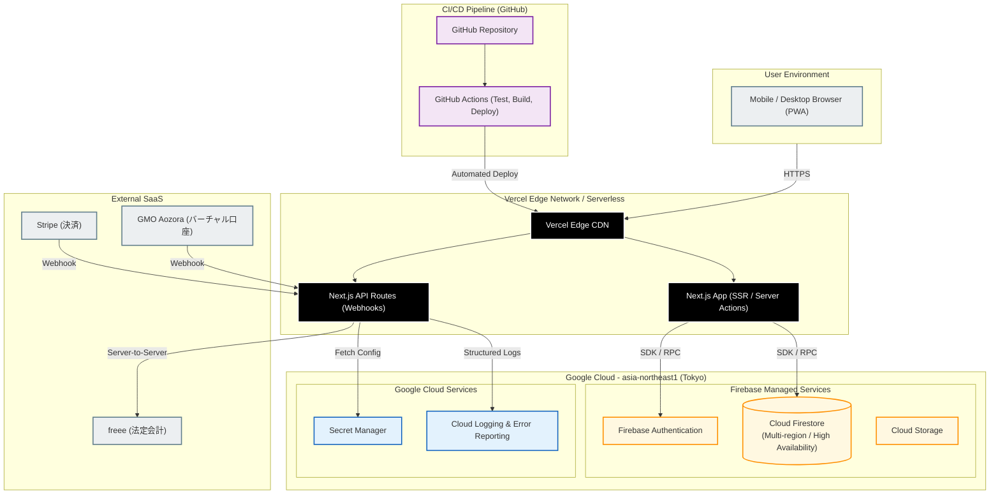

# ASAHI Coach App - Deployment Architecture (物理・実行構成図)

本アーキテクチャ図は、ASAHI Coach App が実際にどのクラウドプラットフォーム上でどのように実行されているかを示す、物理・デプロイメント構成図です。CI/CD パイプラインからエッジネットワーク、および各サービスのホスティング環境を可視化しています。

> [!TIP]
> **SVG / PNG / draw.io 形式での出力方法**
> 本図は Mermaid.js 記法で作成されています。Draw.io の `[Arrange] -> [Insert] -> [Advanced] -> [Mermaid]` からインポートすることで、グラフィカルな図として保存・エクスポートが可能です。

