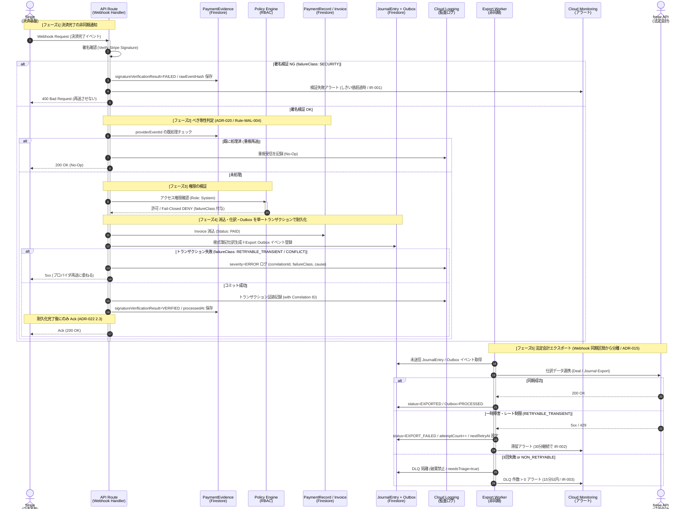

# ASAHI Coach App - Payment & Accounting Sequence Diagram

本図は、外部決済プロバイダ（Stripe 等）からの Webhook 受信を起点とした、「決済の消込」「複式簿記仕訳の生成」「監査ログへの記録」「法定会計（freee）へのエクスポート」に至る一連の時系列データ処理フローを示すシーケンス図です。
IR-001（インシデントレスポンス）や IR-002 等における、トランザクションの追跡性（Correlation ID）と処理の完全性を証明するための監査資料として利用します。

本図は正常系に加え、**異常系（署名検証失敗・重複受信・耐久化失敗・エクスポート失敗）の分岐と応答コードを明示**します。応答コードの決定規則は ADR-022（エラー伝播・失敗可視化原則）2.3 Ack 境界原則に従い、`freee` への法定会計エクスポートは ADR-010 / ADR-015 に基づき Webhook 同期区間から切り離した非同期ワーカーが担当します。

> [!TIP]
> **SVG / PNG / draw.io 形式での出力方法**
> 本図は Mermaid.js 記法で作成されています。Draw.io の `[Arrange] -> [Insert] -> [Advanced] -> [Mermaid]` からインポートすることで、グラフィカルな図として保存・エクスポートが可能です。

