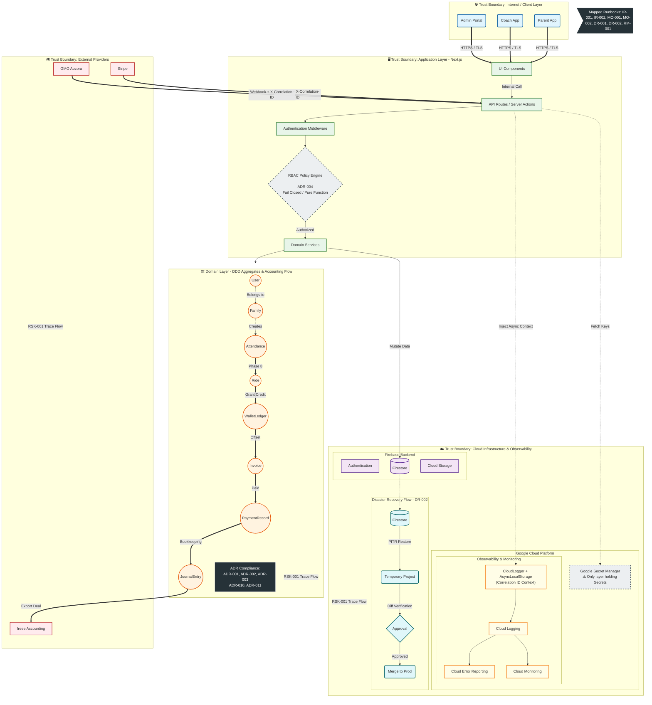

# ASAHI Coach App - System Architecture Diagram (Production Readiness Review)

本アーキテクチャ図は、ASAHI Coach App の本番運用審査（Production Readiness Review）に向けた公式システム構成図です。  
クライアント、アプリケーション、ドメイン境界、インフラストラクチャ、およびセキュリティバウンダリ（Trust Boundary）の全体像を網羅しています。

> [!TIP]
> **SVG / PNG / draw.io 形式での出力方法**
> 本図は Mermaid.js 記法で作成されています。以下の手順で要求された全フォーマットへの変換・保存が可能です。
> 1. **Draw.io へのインポート**: Draw.io (`app.diagrams.net`) を開き、メニューから `[Arrange] -> [Insert] -> [Advanced] -> [Mermaid]` を選択し、以下のコードブロックを貼り付けて [Insert] を押します。
> 2. **ファイル保存**: そのまま `.drawio` 形式で保存できます。
> 3. **画像エクスポート**: メニューの `[File] -> [Export as]` から `SVG` または `PNG` 形式を選択して出力してください。

